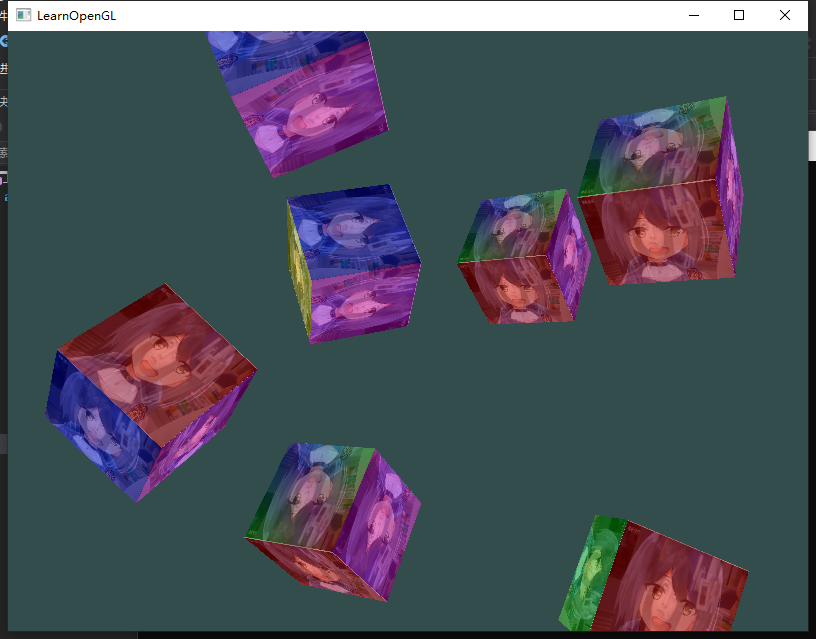
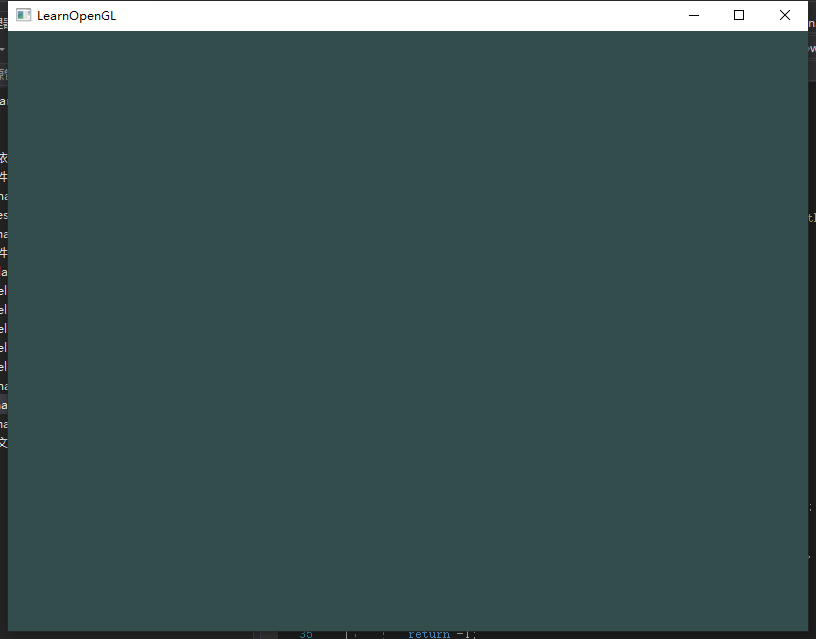
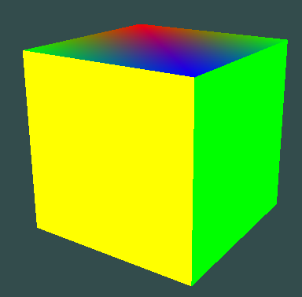
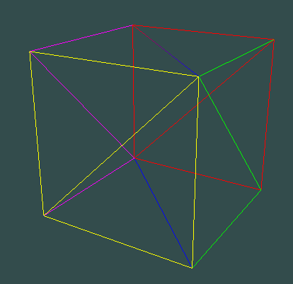
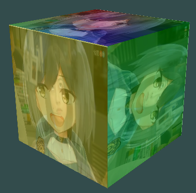
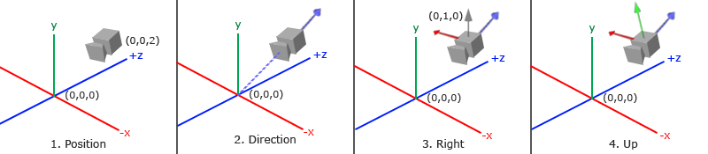
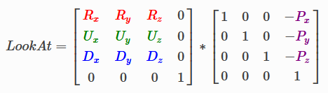
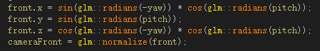

## OpenGL入门
## 目标
* 可以在空间中自由切换角度观察下图。
* 


### 创建一个带背景色的窗口
* 
* 使用GLFW创建OpenGL上下文，定义窗口参数以及处理用户输入。
* 使用GLAD来管理OpenGL的函数指针，让开发者不需要在运行时获取函数地址。
* 设置好视口、游戏循环后，窗口基本框架便出来了。
* 游戏循环结束需要释放资源。


### 虽然来得有点早，但我们先搞个透视MVP矩阵吧
* 使用glm库，可便捷的创建View和Project矩阵，Model矩阵先使用单位矩阵，创建出物体后再做修改。


### 创建出箱子
* 
* 
* 通过VAO配置好VBO信息（是否使用IBO随意），将顶点位置信息，颜色信息绑定好，设置好Model矩阵，shader中配置好layout(location)及相应MVP转换后即可绘制。
* 箱子每个面由两个三角形组成。

### 给箱子加上纹理
* 
* 设置好多张纹理环绕、过滤方式，及加载好纹理图像数据后，将其上传到GPU，并绑定至指定的uniform中。
* 在片段着色器中将多张纹理和顶点颜色进行混合后，即可渲染出上图结果。

```c
FragColor = mix(texture(texture0, TexCoord), texture(texture1, TexCoord), 0.5);
FragColor = mix(vec4(ourColor, 0), FragColor, 0.7);
```

### 创建出多个箱子
* 
* 通过位移、旋转等方式将箱子放在不同的地方。


### 摄像机
* 在整出上面的图后，我们不能自由的切换视角。想修改视角需要修改View矩阵和Project矩阵，重新编译才行。
* 摄像机的职责便是支持动态调整View矩阵和Project矩阵，使之达到切换视角的效果。

#### 什么是摄像机
* 
* 定义一个摄像机，我们需要一个摄像机在世界空间中的位置、观察的方向（注意方向）、一个指向它的右测的向量以及一个指向它上方的向量。
* 实际上就是要摄像机位置及以摄像机位置为原点的坐标系。
* 如同我们拍照一般，在摆好景（设置好Model矩阵）后，我们可以从不同角度观察景进行拍照，游戏中的摄像机便如同拍照手中的相机，拍下照片那一刻便是将景色所在世界空间转换到相机的观察空间中（View矩阵），于是摄像机的原理便是坐标系的转换（不全对），所以要实现摄像机，便是要实现支持动态修改将世界坐标转换到观察坐标的矩阵（View矩阵）。
* 
```c
view = glm::lookAt(cameraPos, cameraPos + cameraFront, cameraUp);
```
* View矩阵可由上面式子直接得出。

#### 实现动态修改
* 经过上面的介绍，摄像机的核心内容已经讲述完毕，接下来只需支持通过键盘、鼠标等外设输入动态修改摄像机位置、朝向等值即可。
##### 位移
* 由glm::lookAt方法可以看出，对于位置的修改，我们只需修改cameraPos即可，通过监听键盘按键进行pos相应处理即可。
##### 视角移动
* 鼠标的输入改变cameraFront向量，即可修改摄像机观察的方向，从而达到视角移动的目的。
* 欧拉角：
* 
* 俯仰角是描述我们如何往上和往下看的角，它在第一张图中表示。第二张图显示了偏航角，偏航角表示我们往左和往右看的大小。滚转角代表我们如何翻滚摄像机，这里讨论的摄像机只处理俯仰角和偏航角。
*  
* 
##### 缩放
* 通过调整透视矩阵的视野大小（fov），当视野变小时可视区域就会减小，产生放大了的感觉。
